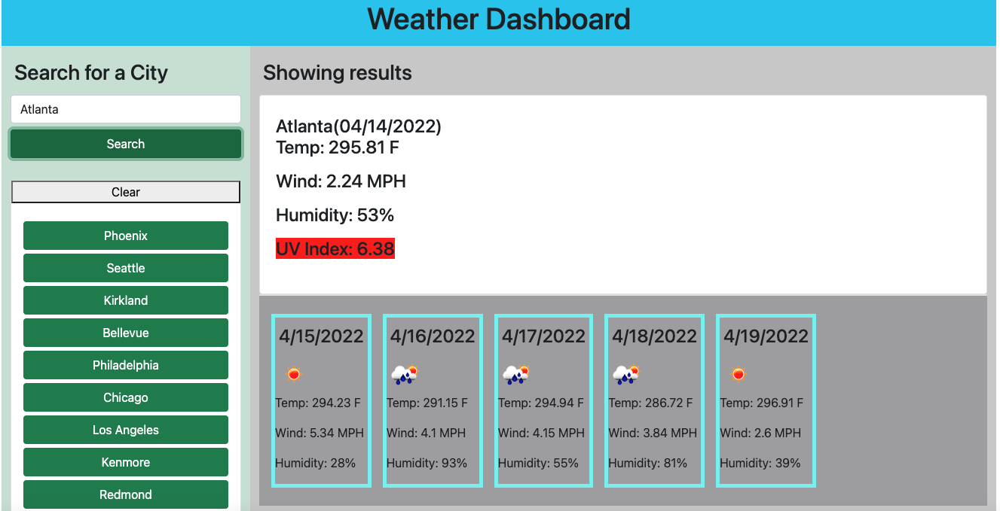
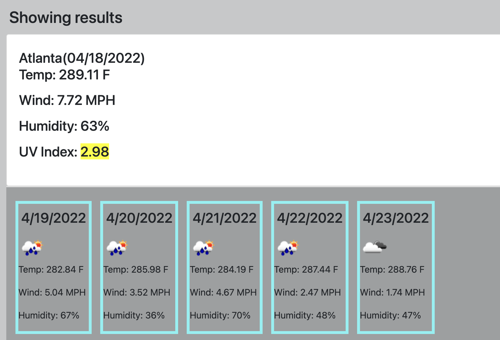

# weatherReport

Table of Contents

- [weatherReport](#weatherreport)
  - [Descripttion](#descripttion)
  - [Mock-Up](#mock-up)
  - [Questions](#questions)

---

## Descripttion

Deployed https://kayjinyi.github.io/weatherReport/

User Story
AS A traveler
I WANT to see the weather outlook for multiple cities

SO THAT I can plan a trip accordingly
Acceptance Criteria

GIVEN a weather dashboard with form inputs
WHEN I search for a city

THEN I am presented with current and future conditions for that city and that city is added to the search history

WHEN I view current weather conditions for that city

THEN I am presented with the city name, the date, an icon representation of weather conditions, the temperature, the humidity, the wind speed, and the UV index

WHEN I view the UV index

THEN I am presented with a color that indicates whether the conditions are favorable, moderate, or severe

WHEN I view future weather conditions for that city

THEN I am presented with a 5-day forecast that displays the date, an icon representation of weather conditions, the temperature, the wind speed, and the humidity

WHEN I click on a city in the search history

THEN I am again presented with current and future conditions for that city

## Mock-Up

The following image shows the web application's appearance and functionality:

The following image shows the web application's appearance and functionality:

## Questions

Feel free to reach out via Github or email with any questions.  
[Github](https://github.com/kayjinyi)  
[email](mailto:kayjinyi@gmail.com)
